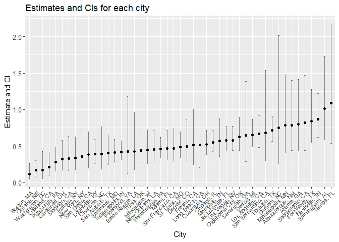
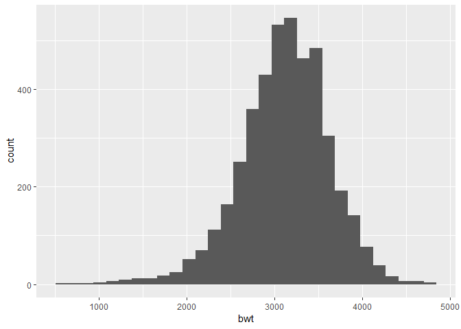
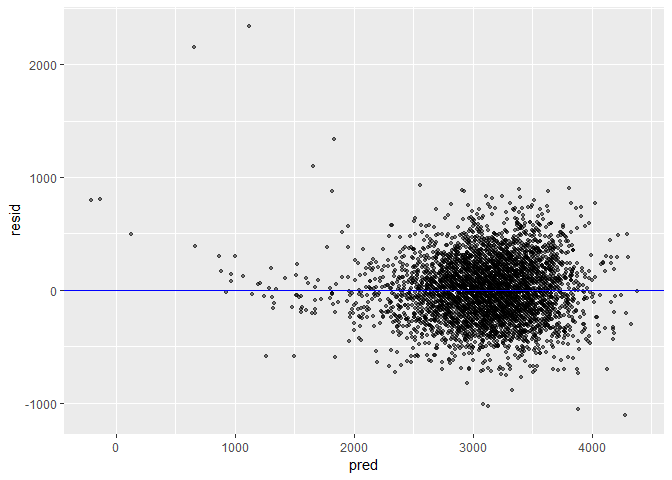
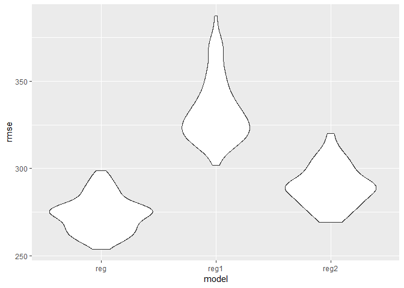

p8105\_hw6\_rj2543
================
rj2543
November 19, 2018

Problem 1
=========

The Washington Post has gathered data on homicides in 50 large U.S. cities and made the data available through a GitHub repository. You can read their accompanying article.

``` r
homicide = read_csv("./data/homicide-data.csv") %>% 
  janitor::clean_names() 
```

    ## Parsed with column specification:
    ## cols(
    ##   uid = col_character(),
    ##   reported_date = col_integer(),
    ##   victim_last = col_character(),
    ##   victim_first = col_character(),
    ##   victim_race = col_character(),
    ##   victim_age = col_character(),
    ##   victim_sex = col_character(),
    ##   city = col_character(),
    ##   state = col_character(),
    ##   lat = col_double(),
    ##   lon = col_double(),
    ##   disposition = col_character()
    ## )

``` r
homicide
```

    ## # A tibble: 52,179 x 12
    ##    uid   reported_date victim_last victim_first victim_race victim_age
    ##    <chr>         <int> <chr>       <chr>        <chr>       <chr>     
    ##  1 Alb-~      20100504 GARCIA      JUAN         Hispanic    78        
    ##  2 Alb-~      20100216 MONTOYA     CAMERON      Hispanic    17        
    ##  3 Alb-~      20100601 SATTERFIELD VIVIANA      White       15        
    ##  4 Alb-~      20100101 MENDIOLA    CARLOS       Hispanic    32        
    ##  5 Alb-~      20100102 MULA        VIVIAN       White       72        
    ##  6 Alb-~      20100126 BOOK        GERALDINE    White       91        
    ##  7 Alb-~      20100127 MALDONADO   DAVID        Hispanic    52        
    ##  8 Alb-~      20100127 MALDONADO   CONNIE       Hispanic    52        
    ##  9 Alb-~      20100130 MARTIN-LEY~ GUSTAVO      White       56        
    ## 10 Alb-~      20100210 HERRERA     ISRAEL       Hispanic    43        
    ## # ... with 52,169 more rows, and 6 more variables: victim_sex <chr>,
    ## #   city <chr>, state <chr>, lat <dbl>, lon <dbl>, disposition <chr>

Create a city\_state variable (e.g. “Baltimore, MD”), and a binary variable indicating whether the homicide is solved. Omit cities Dallas, TX; Phoenix, AZ; and Kansas City, MO – these don’t report victim race. Also omit Tulsa, AL – this is a data entry mistake. Modifiy victim\_race to have categories white and non-white, with white as the reference category. Be sure that victim\_age is numeric.

``` r
homi = homicide %>% 
  unite(city_state, city, state, sep = ", ") %>% 
  mutate(solved = ifelse(disposition == "Open/No arrest", 0, 1)) %>% # 1: Closed without arrest/Closed by arrest; 0: Open/No arrest
  filter(!(city_state %in% c("Dallas, TX", "Phoenix, AZ", "Kansas City, MO", "Tulsa, AL"))) %>% 
  mutate(victim_race = ifelse(victim_race == "White", "white", "non-white")) %>% # modify 'victim_race' to have categories
  mutate(victim_race = forcats::fct_relevel(victim_race, ref = "white")) %>% # with white as the reference category
  mutate(victim_age = suppressWarnings(as.numeric(victim_age)))

homi
```

    ## # A tibble: 48,507 x 12
    ##    uid   reported_date victim_last victim_first victim_race victim_age
    ##    <chr>         <int> <chr>       <chr>        <fct>            <dbl>
    ##  1 Alb-~      20100504 GARCIA      JUAN         non-white           78
    ##  2 Alb-~      20100216 MONTOYA     CAMERON      non-white           17
    ##  3 Alb-~      20100601 SATTERFIELD VIVIANA      white               15
    ##  4 Alb-~      20100101 MENDIOLA    CARLOS       non-white           32
    ##  5 Alb-~      20100102 MULA        VIVIAN       white               72
    ##  6 Alb-~      20100126 BOOK        GERALDINE    white               91
    ##  7 Alb-~      20100127 MALDONADO   DAVID        non-white           52
    ##  8 Alb-~      20100127 MALDONADO   CONNIE       non-white           52
    ##  9 Alb-~      20100130 MARTIN-LEY~ GUSTAVO      white               56
    ## 10 Alb-~      20100210 HERRERA     ISRAEL       non-white           43
    ## # ... with 48,497 more rows, and 6 more variables: victim_sex <chr>,
    ## #   city_state <chr>, lat <dbl>, lon <dbl>, disposition <chr>,
    ## #   solved <dbl>

For the city of Baltimore, MD, use the glm function to fit a logistic regression with resolved vs unresolved as the outcome and victim age, sex and race (as just defined) as predictors. Save the output of glm as an R object; apply the broom::tidy to this object; and obtain the estimate and confidence interval of the adjusted odds ratio for solving homicides comparing non-white victims to white victims keeping all other variables fixed.

``` r
baltimore = homi %>% 
  filter(city_state == "Baltimore, MD")

reg_baltimore = glm(solved~victim_age+victim_sex+victim_race, family = binomial(link = "logit"), data = baltimore) 

OR_CI = rbind(exp(confint(reg_baltimore, "victim_racenon-white")))
```

    ## Waiting for profiling to be done...

``` r
reg_baltimore %>%  
  broom::tidy() %>% 
  filter(term == "victim_racenon-white") %>% 
  mutate(OR_estimate = exp(estimate), OR_CI_low = OR_CI[1], OR_CI_up = OR_CI[2]) %>%
  select(term, OR_estimate, OR_CI_low, OR_CI_up) %>% 
  knitr::kable(digits = 5)
```

| term                  |  OR\_estimate|  OR\_CI\_low|  OR\_CI\_up|
|:----------------------|-------------:|------------:|-----------:|
| victim\_racenon-white |       0.41389|      0.28929|     0.58708|

``` r
#baltimore %>% 
  #modelr::add_predictions(reg_baltimore) %>% 
  #mutate(fitted_prob = boot::inv.logit(pred))
```

Now run glm for each of the cities in your dataset, and extract the adjusted odds ratio (and CI) for solving homicides comparing non-white victims to white victims. Do this within a “tidy” pipeline, making use of purrr::map, list columns, and unnest as necessary to create a dataframe with estimated ORs and CIs for each city.

``` r
or_ci = function(city){
  city_info = homi %>% 
    filter(city_state == city)
  
  reg_city = glm(solved~victim_age+victim_sex+victim_race, family = binomial(link = "logit"), data = city_info)
  
  tidy_city = reg_city %>% 
    broom::tidy() %>% 
    filter(term == "victim_racenon-white")
  
  OR_estimate = exp(tidy_city$estimate)
  OR_CI = rbind(exp(confint(reg_city, "victim_racenon-white")))
  
  return(tibble(
    OR_estimate,
    OR_CI_low = OR_CI[1],
    OR_CI_up = OR_CI[2]
  ))
}

OR_CI_city = homi %>% 
  group_by(city_state) %>% 
  nest() %>% 
  mutate(info = map(city_state, or_ci)) %>% 
  select(city_state, info) %>% 
  unnest()

OR_CI_city %>% 
  knitr::kable(digits = 5)
```

| city\_state        |  OR\_estimate|  OR\_CI\_low|  OR\_CI\_up|
|:-------------------|-------------:|------------:|-----------:|
| Albuquerque, NM    |       0.78491|      0.43647|     1.39764|
| Atlanta, GA        |       0.79506|      0.42977|     1.41108|
| Baltimore, MD      |       0.41389|      0.28929|     0.58708|
| Baton Rouge, LA    |       0.42563|      0.17202|     0.95433|
| Birmingham, AL     |       1.01272|      0.58106|     1.72940|
| Boston, MA         |       0.11455|      0.04251|     0.25852|
| Buffalo, NY        |       0.33675|      0.17628|     0.62365|
| Charlotte, NC      |       0.39298|      0.18335|     0.76288|
| Chicago, IL        |       0.54932|      0.42307|     0.71340|
| Cincinnati, OH     |       0.32312|      0.17045|     0.57768|
| Columbus, OH       |       0.52233|      0.37953|     0.71463|
| Denver, CO         |       0.49412|      0.27842|     0.85928|
| Detroit, MI        |       0.64987|      0.48598|     0.86800|
| Durham, NC         |       0.75189|      0.25037|     2.01391|
| Fort Worth, TX     |       0.83850|      0.54652|     1.27625|
| Fresno, CA         |       0.51362|      0.24213|     1.00852|
| Houston, TX        |       0.71740|      0.56403|     0.90819|
| Indianapolis, IN   |       0.42027|      0.30778|     0.56851|
| Jacksonville, FL   |       0.57769|      0.43197|     0.76873|
| Las Vegas, NV      |       0.57965|      0.43478|     0.76847|
| Long Beach, CA     |       0.51474|      0.20465|     1.17390|
| Los Angeles, CA    |       0.66584|      0.48123|     0.91600|
| Louisville, KY     |       0.39191|      0.25723|     0.58990|
| Memphis, TN        |       0.56636|      0.35524|     0.87635|
| Miami, FL          |       0.46733|      0.30532|     0.71196|
| Milwaukee, wI      |       0.44267|      0.26036|     0.72162|
| Minneapolis, MN    |       0.78310|      0.40628|     1.47530|
| Nashville, TN      |       0.86926|      0.61542|     1.22022|
| New Orleans, LA    |       0.44977|      0.28147|     0.71207|
| New York, NY       |       0.35460|      0.15685|     0.72312|
| Oakland, CA        |       0.21298|      0.09892|     0.41819|
| Oklahoma City, OK  |       0.62367|      0.43543|     0.88968|
| Omaha, NE          |       0.16493|      0.08570|     0.29753|
| Philadelphia, PA   |       0.45692|      0.33256|     0.61971|
| Pittsburgh, PA     |       0.28156|      0.15725|     0.48524|
| Richmond, VA       |       0.42444|      0.11893|     1.18073|
| San Antonio, TX    |       0.40553|      0.24316|     0.65143|
| Sacramento, CA     |       0.81594|      0.44035|     1.46762|
| Savannah, GA       |       0.64243|      0.28736|     1.38626|
| San Bernardino, CA |       0.67789|      0.29158|     1.53631|
| San Diego, CA      |       0.37958|      0.19734|     0.69410|
| San Francisco, CA  |       0.46920|      0.29461|     0.73691|
| St. Louis, MO      |       0.48396|      0.33502|     0.69227|
| Stockton, CA       |       0.32491|      0.16071|     0.62929|
| Tampa, FL          |       1.08625|      0.53685|     2.17851|
| Tulsa, OK          |       0.44120|      0.27954|     0.68258|
| Washington, DC     |       0.16756|      0.04953|     0.42673|

Create a plot that shows the estimated ORs and CIs for each city. Organize cities according to estimated OR, and comment on the plot.

``` r
OR_CI_city %>% 
  mutate(city_state = fct_reorder(city_state, OR_estimate)) %>% 
  ggplot(aes(x = city_state, y = OR_estimate)) +
  geom_point() +
  geom_errorbar(aes(x = city_state, ymin = OR_CI_low, ymax = OR_CI_up), width = 0.2, alpha = 0.5) + # add error bars based on upper and lower limits of CI for each city
  labs(
    title = "OR for solving homicides comparing non-white victims to white victims",
    x = "City",
    y = "Estimate and CI"
  ) +
  theme(axis.text.x = element_text(size = 8, angle = 45, hjust = 1),
        axis.text.y = element_text(size = 10)) # make city_state names readable
```



**Comments** From the plot, we can see that estimates of adjusted OR range from about 0.1 to round 1.1. Most of estimates are under 1 (about 3/4 cities with estimates between 0.25 and 0.75) showing that homicides with non-white victims tend to be unsolved compared to those with white victims. Richmond, Savannah, San Bernardino, Durham, Birmingham and Tampa have significantly wider CIs than other cities.

Problem 2
=========

In this probelm, you will analyze data gathered to understand the effects of several variables on a child’s birthweight. This dataset, available here, consists of roughly 4000 children and includes the following variables:

-   babysex: baby’s sex (male = 1, female = 2)

-   bhead: baby’s head circumference at birth (centimeters)

-   blength: baby’s length at birth (centimeteres)

-   bwt: baby’s birth weight (grams)

-   delwt: mother’s weight at delivery (pounds)

-   fincome: family monthly income (in hundreds, rounded)

-   frace: father’s race (1= White, 2 = Black, 3 = Asian, 4 = Puerto Rican, 8 = Other, 9 = Unknown)

-   gaweeks: gestational age in weeks

-   malform: presence of malformations that could affect weight (0 = absent, 1 = present)

-   menarche: mother’s age at menarche (years)

-   mheigth: mother’s height (inches)

-   momage: mother’s age at delivery (years)

-   mrace: mother’s race (1= White, 2 = Black, 3 = Asian, 4 = Puerto Rican, 8 = Other)

-   parity: number of live births prior to this pregnancy

-   pnumlbw: previous number of low birth weight babies

-   pnumgsa: number of prior small for gestational age babies

-   ppbmi: mother’s pre-pregnancy BMI

-   ppwt: mother’s pre-pregnancy weight (pounds)

-   smoken: average number of cigarettes smoked per day during pregnancy

-   wtgain: mother’s weight gain during pregnancy (pounds)

Load and clean the data for regression analysis (i.e. convert numeric to factor where appropriate, check for missing data, etc.).

``` r
birthweight = read_csv("./data/birthweight.csv") %>% 
  janitor::clean_names() %>% 
  mutate(babysex = as.factor(babysex), frace = as.factor(frace), malform = as.factor(malform), mrace = as.factor(mrace))
```

    ## Parsed with column specification:
    ## cols(
    ##   .default = col_integer(),
    ##   gaweeks = col_double(),
    ##   ppbmi = col_double(),
    ##   smoken = col_double()
    ## )

    ## See spec(...) for full column specifications.

``` r
birthweight
```

    ## # A tibble: 4,342 x 20
    ##    babysex bhead blength   bwt delwt fincome frace gaweeks malform menarche
    ##    <fct>   <int>   <int> <int> <int>   <int> <fct>   <dbl> <fct>      <int>
    ##  1 2          34      51  3629   177      35 1        39.9 0             13
    ##  2 1          34      48  3062   156      65 2        25.9 0             14
    ##  3 2          36      50  3345   148      85 1        39.9 0             12
    ##  4 1          34      52  3062   157      55 1        40   0             14
    ##  5 2          34      52  3374   156       5 1        41.6 0             13
    ##  6 1          33      52  3374   129      55 1        40.7 0             12
    ##  7 2          33      46  2523   126      96 2        40.3 0             14
    ##  8 2          33      49  2778   140       5 1        37.4 0             12
    ##  9 1          36      52  3515   146      85 1        40.3 0             11
    ## 10 1          33      50  3459   169      75 2        40.7 0             12
    ## # ... with 4,332 more rows, and 10 more variables: mheight <int>,
    ## #   momage <int>, mrace <fct>, parity <int>, pnumlbw <int>, pnumsga <int>,
    ## #   ppbmi <dbl>, ppwt <int>, smoken <dbl>, wtgain <int>

Propose a regression model for birthweight. This model may be based on a hypothesized structure for the factors that underly birthweight, on a data-driven model-building process, or a combination of the two. Describe your modeling process and show a plot of model residuals against fitted values – use add\_predictions and add\_residuals in making this plot.

``` r
birthweight %>% 
  ggplot(aes(x = bwt)) +
  geom_histogram()
```

    ## `stat_bin()` using `bins = 30`. Pick better value with `binwidth`.



``` r
reg = lm(bwt~., data = birthweight)

reg_stepwise = step(reg, direction = "both")
```

    ## Start:  AIC=48717.83
    ## bwt ~ babysex + bhead + blength + delwt + fincome + frace + gaweeks + 
    ##     malform + menarche + mheight + momage + mrace + parity + 
    ##     pnumlbw + pnumsga + ppbmi + ppwt + smoken + wtgain
    ## 
    ## 
    ## Step:  AIC=48717.83
    ## bwt ~ babysex + bhead + blength + delwt + fincome + frace + gaweeks + 
    ##     malform + menarche + mheight + momage + mrace + parity + 
    ##     pnumlbw + pnumsga + ppbmi + ppwt + smoken
    ## 
    ## 
    ## Step:  AIC=48717.83
    ## bwt ~ babysex + bhead + blength + delwt + fincome + frace + gaweeks + 
    ##     malform + menarche + mheight + momage + mrace + parity + 
    ##     pnumlbw + ppbmi + ppwt + smoken
    ## 
    ## 
    ## Step:  AIC=48717.83
    ## bwt ~ babysex + bhead + blength + delwt + fincome + frace + gaweeks + 
    ##     malform + menarche + mheight + momage + mrace + parity + 
    ##     ppbmi + ppwt + smoken
    ## 
    ##            Df Sum of Sq       RSS   AIC
    ## - frace     4    124365 320848704 48712
    ## - malform   1      1419 320725757 48716
    ## - ppbmi     1      6346 320730684 48716
    ## - momage    1     28661 320752999 48716
    ## - mheight   1     66886 320791224 48717
    ## - menarche  1    111679 320836018 48717
    ## - ppwt      1    131132 320855470 48718
    ## <none>                  320724338 48718
    ## - fincome   1    193454 320917792 48718
    ## - parity    1    413584 321137922 48721
    ## - mrace     3    868321 321592659 48724
    ## - babysex   1    853796 321578134 48727
    ## - gaweeks   1   4611823 325336161 48778
    ## - smoken    1   5076393 325800732 48784
    ## - delwt     1   8008891 328733230 48823
    ## - blength   1 102050296 422774634 49915
    ## - bhead     1 106535716 427260054 49961
    ## 
    ## Step:  AIC=48711.51
    ## bwt ~ babysex + bhead + blength + delwt + fincome + gaweeks + 
    ##     malform + menarche + mheight + momage + mrace + parity + 
    ##     ppbmi + ppwt + smoken
    ## 
    ##            Df Sum of Sq       RSS   AIC
    ## - malform   1      1447 320850151 48710
    ## - ppbmi     1      6975 320855679 48710
    ## - momage    1     28379 320877083 48710
    ## - mheight   1     69502 320918206 48710
    ## - menarche  1    115708 320964411 48711
    ## - ppwt      1    133961 320982665 48711
    ## <none>                  320848704 48712
    ## - fincome   1    194405 321043108 48712
    ## - parity    1    414687 321263390 48715
    ## + frace     4    124365 320724338 48718
    ## - babysex   1    852133 321700837 48721
    ## - gaweeks   1   4625208 325473911 48772
    ## - smoken    1   5036389 325885093 48777
    ## - delwt     1   8013099 328861802 48817
    ## - mrace     3  13540415 334389119 48885
    ## - blength   1 101995688 422844392 49908
    ## - bhead     1 106662962 427511666 49956
    ## 
    ## Step:  AIC=48709.53
    ## bwt ~ babysex + bhead + blength + delwt + fincome + gaweeks + 
    ##     menarche + mheight + momage + mrace + parity + ppbmi + ppwt + 
    ##     smoken
    ## 
    ##            Df Sum of Sq       RSS   AIC
    ## - ppbmi     1      6928 320857079 48708
    ## - momage    1     28660 320878811 48708
    ## - mheight   1     69320 320919470 48708
    ## - menarche  1    116027 320966177 48709
    ## - ppwt      1    133894 320984044 48709
    ## <none>                  320850151 48710
    ## - fincome   1    193784 321043934 48710
    ## + malform   1      1447 320848704 48712
    ## - parity    1    414482 321264633 48713
    ## + frace     4    124393 320725757 48716
    ## - babysex   1    851279 321701430 48719
    ## - gaweeks   1   4624003 325474154 48770
    ## - smoken    1   5035195 325885346 48775
    ## - delwt     1   8029079 328879230 48815
    ## - mrace     3  13553320 334403471 48883
    ## - blength   1 102009225 422859375 49906
    ## - bhead     1 106675331 427525481 49954
    ## 
    ## Step:  AIC=48707.63
    ## bwt ~ babysex + bhead + blength + delwt + fincome + gaweeks + 
    ##     menarche + mheight + momage + mrace + parity + ppwt + smoken
    ## 
    ##            Df Sum of Sq       RSS   AIC
    ## - momage    1     29211 320886290 48706
    ## - menarche  1    117635 320974714 48707
    ## <none>                  320857079 48708
    ## - fincome   1    195199 321052278 48708
    ## + ppbmi     1      6928 320850151 48710
    ## + malform   1      1400 320855679 48710
    ## - parity    1    412984 321270064 48711
    ## + frace     4    125020 320732060 48714
    ## - babysex   1    850020 321707099 48717
    ## - mheight   1   1078673 321935752 48720
    ## - ppwt      1   2934023 323791103 48745
    ## - gaweeks   1   4621504 325478583 48768
    ## - smoken    1   5039368 325896447 48773
    ## - delwt     1   8024939 328882018 48813
    ## - mrace     3  13551444 334408523 48881
    ## - blength   1 102018559 422875638 49904
    ## - bhead     1 106821342 427678421 49953
    ## 
    ## Step:  AIC=48706.02
    ## bwt ~ babysex + bhead + blength + delwt + fincome + gaweeks + 
    ##     menarche + mheight + mrace + parity + ppwt + smoken
    ## 
    ##            Df Sum of Sq       RSS   AIC
    ## - menarche  1    100121 320986412 48705
    ## <none>                  320886290 48706
    ## - fincome   1    240800 321127090 48707
    ## + momage    1     29211 320857079 48708
    ## + ppbmi     1      7479 320878811 48708
    ## + malform   1      1678 320884612 48708
    ## - parity    1    431433 321317724 48710
    ## + frace     4    124743 320761547 48712
    ## - babysex   1    841278 321727568 48715
    ## - mheight   1   1076739 321963029 48719
    ## - ppwt      1   2913653 323799943 48743
    ## - gaweeks   1   4676469 325562760 48767
    ## - smoken    1   5045104 325931394 48772
    ## - delwt     1   8000672 328886962 48811
    ## - mrace     3  14667730 335554021 48894
    ## - blength   1 101990556 422876847 49902
    ## - bhead     1 106864308 427750598 49952
    ## 
    ## Step:  AIC=48705.38
    ## bwt ~ babysex + bhead + blength + delwt + fincome + gaweeks + 
    ##     mheight + mrace + parity + ppwt + smoken
    ## 
    ##            Df Sum of Sq       RSS   AIC
    ## <none>                  320986412 48705
    ## + menarche  1    100121 320886290 48706
    ## - fincome   1    245637 321232048 48707
    ## + momage    1     11698 320974714 48707
    ## + ppbmi     1      8823 320977589 48707
    ## + malform   1      1884 320984528 48707
    ## - parity    1    422770 321409181 48709
    ## + frace     4    128726 320857686 48712
    ## - babysex   1    846134 321832545 48715
    ## - mheight   1   1012240 321998651 48717
    ## - ppwt      1   2907049 323893461 48743
    ## - gaweeks   1   4662501 325648912 48766
    ## - smoken    1   5073849 326060260 48771
    ## - delwt     1   8137459 329123871 48812
    ## - mrace     3  14683609 335670021 48894
    ## - blength   1 102191779 423178191 49903
    ## - bhead     1 106779754 427766166 49950

``` r
summary(reg_stepwise)
```

    ## 
    ## Call:
    ## lm(formula = bwt ~ babysex + bhead + blength + delwt + fincome + 
    ##     gaweeks + mheight + mrace + parity + ppwt + smoken, data = birthweight)
    ## 
    ## Residuals:
    ##      Min       1Q   Median       3Q      Max 
    ## -1097.18  -185.52    -3.39   174.14  2353.44 
    ## 
    ## Coefficients:
    ##               Estimate Std. Error t value Pr(>|t|)    
    ## (Intercept) -6098.8219   137.5463 -44.340  < 2e-16 ***
    ## babysex2       28.5580     8.4549   3.378 0.000737 ***
    ## bhead         130.7770     3.4466  37.944  < 2e-16 ***
    ## blength        74.9471     2.0190  37.120  < 2e-16 ***
    ## delwt           4.1067     0.3921  10.475  < 2e-16 ***
    ## fincome         0.3180     0.1747   1.820 0.068844 .  
    ## gaweeks        11.5925     1.4621   7.929 2.79e-15 ***
    ## mheight         6.5940     1.7849   3.694 0.000223 ***
    ## mrace2       -138.7925     9.9071 -14.009  < 2e-16 ***
    ## mrace3        -74.8868    42.3146  -1.770 0.076837 .  
    ## mrace4       -100.6781    19.3247  -5.210 1.98e-07 ***
    ## parity         96.3047    40.3362   2.388 0.017004 *  
    ## ppwt           -2.6756     0.4274  -6.261 4.20e-10 ***
    ## smoken         -4.8434     0.5856  -8.271  < 2e-16 ***
    ## ---
    ## Signif. codes:  0 '***' 0.001 '**' 0.01 '*' 0.05 '.' 0.1 ' ' 1
    ## 
    ## Residual standard error: 272.3 on 4328 degrees of freedom
    ## Multiple R-squared:  0.7181, Adjusted R-squared:  0.7173 
    ## F-statistic: 848.1 on 13 and 4328 DF,  p-value: < 2.2e-16

``` r
reg_bwt = lm(bwt~babysex+bhead+blength+delwt+gaweeks+mheight+mrace+ppwt+smoken, data = birthweight)

summary(reg_bwt)
```

    ## 
    ## Call:
    ## lm(formula = bwt ~ babysex + bhead + blength + delwt + gaweeks + 
    ##     mheight + mrace + ppwt + smoken, data = birthweight)
    ## 
    ## Residuals:
    ##      Min       1Q   Median       3Q      Max 
    ## -1104.52  -183.71    -2.92   174.58  2336.55 
    ## 
    ## Coefficients:
    ##               Estimate Std. Error t value Pr(>|t|)    
    ## (Intercept) -6090.6410   137.5628 -44.275  < 2e-16 ***
    ## babysex2       28.9272     8.4577   3.420 0.000631 ***
    ## bhead         131.1745     3.4460  38.065  < 2e-16 ***
    ## blength        74.7285     2.0187  37.018  < 2e-16 ***
    ## delwt           4.1053     0.3921  10.471  < 2e-16 ***
    ## gaweeks        11.4086     1.4579   7.825 6.32e-15 ***
    ## mheight         6.8133     1.7803   3.827 0.000132 ***
    ## mrace2       -145.4960     9.2303 -15.763  < 2e-16 ***
    ## mrace3        -78.1687    42.3138  -1.847 0.064764 .  
    ## mrace4       -106.5370    19.1169  -5.573 2.66e-08 ***
    ## ppwt           -2.6726     0.4274  -6.253 4.40e-10 ***
    ## smoken         -4.8782     0.5858  -8.327  < 2e-16 ***
    ## ---
    ## Signif. codes:  0 '***' 0.001 '**' 0.01 '*' 0.05 '.' 0.1 ' ' 1
    ## 
    ## Residual standard error: 272.5 on 4330 degrees of freedom
    ## Multiple R-squared:  0.7175, Adjusted R-squared:  0.7168 
    ## F-statistic: 999.9 on 11 and 4330 DF,  p-value: < 2.2e-16

``` r
birthweight %>% 
  modelr::add_residuals(., reg_bwt) %>% 
  modelr::add_predictions(., reg_bwt) %>% 
  ggplot(aes(x = pred, y = resid)) +
  geom_point(alpha = 0.5, size = 1) +
  geom_abline(aes(slope = 0, intercept = 0), color = "blue")
```



**Modeling Process** First, from the bwt distribution plot, we can see that the underlying distribution tends to be a bell-shaped and slightly skewed one. Transformation of bwt seems unnecessary at this point. Then, we try to fit the model with no interaction terms using "stepwise" model selection methods. By only taking predictors with significantly small p-value into consideration, we come to the model with babysex, bhead, blength, delwt, gaweeks, mheight, mrace, ppwt and smoken predictors. The adjusted R-square of this model is about 0.7173 which looks fair at this time. The plot of model residuals against fitted values shows that the assumption of the model seems satisfied as well. However, it may be better to include the interaction effects in further study.

Compare your model to two others:

-   One using length at birth and gestational age as predictors (main effects only)

``` r
reg1 = lm(bwt~blength+gaweeks, data = birthweight)

summary(reg1)
```

    ## 
    ## Call:
    ## lm(formula = bwt ~ blength + gaweeks, data = birthweight)
    ## 
    ## Residuals:
    ##     Min      1Q  Median      3Q     Max 
    ## -1709.6  -215.4   -11.4   208.2  4188.8 
    ## 
    ## Coefficients:
    ##              Estimate Std. Error t value Pr(>|t|)    
    ## (Intercept) -4347.667     97.958  -44.38   <2e-16 ***
    ## blength       128.556      1.990   64.60   <2e-16 ***
    ## gaweeks        27.047      1.718   15.74   <2e-16 ***
    ## ---
    ## Signif. codes:  0 '***' 0.001 '**' 0.01 '*' 0.05 '.' 0.1 ' ' 1
    ## 
    ## Residual standard error: 333.2 on 4339 degrees of freedom
    ## Multiple R-squared:  0.5769, Adjusted R-squared:  0.5767 
    ## F-statistic:  2958 on 2 and 4339 DF,  p-value: < 2.2e-16

``` r
reg1 %>% 
  broom::tidy()
```

    ## # A tibble: 3 x 5
    ##   term        estimate std.error statistic  p.value
    ##   <chr>          <dbl>     <dbl>     <dbl>    <dbl>
    ## 1 (Intercept)  -4348.      98.0      -44.4 0.      
    ## 2 blength        129.       1.99      64.6 0.      
    ## 3 gaweeks         27.0      1.72      15.7 2.36e-54

-   One using head circumference, length, sex, and all interactions (including the three-way interaction) between these.

``` r
reg2 = lm(bwt~bhead*blength*babysex, data = birthweight)

summary(reg2)
```

    ## 
    ## Call:
    ## lm(formula = bwt ~ bhead * blength * babysex, data = birthweight)
    ## 
    ## Residuals:
    ##      Min       1Q   Median       3Q      Max 
    ## -1132.99  -190.42   -10.33   178.63  2617.96 
    ## 
    ## Coefficients:
    ##                          Estimate Std. Error t value Pr(>|t|)    
    ## (Intercept)            -7176.8170  1264.8397  -5.674 1.49e-08 ***
    ## bhead                    181.7956    38.0542   4.777 1.84e-06 ***
    ## blength                  102.1269    26.2118   3.896 9.92e-05 ***
    ## babysex2                6374.8684  1677.7669   3.800 0.000147 ***
    ## bhead:blength             -0.5536     0.7802  -0.710 0.478012    
    ## bhead:babysex2          -198.3932    51.0917  -3.883 0.000105 ***
    ## blength:babysex2        -123.7729    35.1185  -3.524 0.000429 ***
    ## bhead:blength:babysex2     3.8781     1.0566   3.670 0.000245 ***
    ## ---
    ## Signif. codes:  0 '***' 0.001 '**' 0.01 '*' 0.05 '.' 0.1 ' ' 1
    ## 
    ## Residual standard error: 287.7 on 4334 degrees of freedom
    ## Multiple R-squared:  0.6849, Adjusted R-squared:  0.6844 
    ## F-statistic:  1346 on 7 and 4334 DF,  p-value: < 2.2e-16

``` r
reg2 %>% 
  broom::tidy()
```

    ## # A tibble: 8 x 5
    ##   term                    estimate std.error statistic      p.value
    ##   <chr>                      <dbl>     <dbl>     <dbl>        <dbl>
    ## 1 (Intercept)            -7177.     1265.       -5.67  0.0000000149
    ## 2 bhead                    182.       38.1       4.78  0.00000184  
    ## 3 blength                  102.       26.2       3.90  0.0000992   
    ## 4 babysex2                6375.     1678.        3.80  0.000147    
    ## 5 bhead:blength             -0.554     0.780    -0.710 0.478       
    ## 6 bhead:babysex2          -198.       51.1      -3.88  0.000105    
    ## 7 blength:babysex2        -124.       35.1      -3.52  0.000429    
    ## 8 bhead:blength:babysex2     3.88      1.06      3.67  0.000245

Make this comparison in terms of the cross-validated prediction error; use crossv\_mc and functions in purrr as appropriate.

``` r
cv_df = crossv_mc(birthweight, 100) %>% 
  mutate(reg_mod = map(train, ~lm(bwt~babysex+bhead+blength+delwt+gaweeks+mheight+mrace+ppwt+smoken, data = .x)),
         reg1_mod = map(train, ~lm(bwt~blength+gaweeks, data = .x)),
         reg2_mod = map(train, ~lm(bwt~bhead*blength*babysex, data = .x))) %>% 
  mutate(rmse_reg = map2_dbl(reg_mod, test, ~rmse(model = .x, data = .y)),
         rmse_reg1 = map2_dbl(reg1_mod, test, ~rmse(model = .x, data = .y)),
         rmse_reg2 = map2_dbl(reg2_mod, test, ~rmse(model = .x, data = .y)))

cv_df %>% 
  select(rmse_reg, rmse_reg1, rmse_reg2) %>%  
  gather(key = model, value = rmse) %>% 
  mutate(model = str_replace(model, "rmse_", ""),
         model = fct_inorder(model)) %>% 
  ggplot(aes(x = model, y = rmse)) + 
  geom_violin()
```



**Comparison** By plotting the cross-validated prediction error distribution for each candidate model, we can see that the first fitted model has the least mean rmse compared to two others. Also, the variance of the first model is no larger than others.

(Note that although we expect your model to be reasonable, model building itself is not a main idea of the course and we don’t necessarily expect your model to be “optimal”.)
