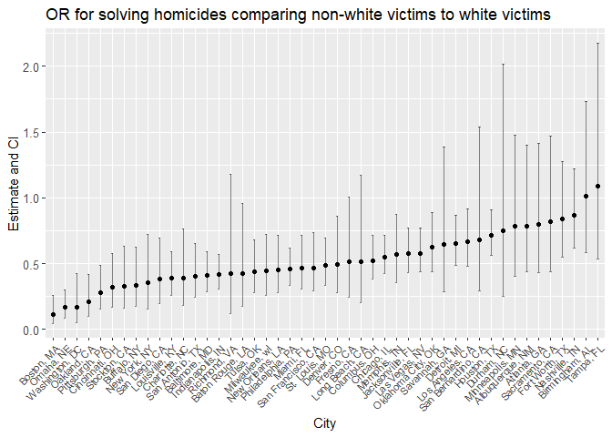

p8105\_hw6\_rj2543
================
rj2543
November 19, 2018

Problem 1
=========

The Washington Post has gathered data on homicides in 50 large U.S. cities and made the data available through a GitHub repository. You can read their accompanying article.

``` r
homicide = read_csv("./data/homicide-data.csv") %>% 
  janitor::clean_names()
```

    ## Parsed with column specification:
    ## cols(
    ##   uid = col_character(),
    ##   reported_date = col_integer(),
    ##   victim_last = col_character(),
    ##   victim_first = col_character(),
    ##   victim_race = col_character(),
    ##   victim_age = col_character(),
    ##   victim_sex = col_character(),
    ##   city = col_character(),
    ##   state = col_character(),
    ##   lat = col_double(),
    ##   lon = col_double(),
    ##   disposition = col_character()
    ## )

``` r
homicide
```

    ## # A tibble: 52,179 x 12
    ##    uid   reported_date victim_last victim_first victim_race victim_age
    ##    <chr>         <int> <chr>       <chr>        <chr>       <chr>     
    ##  1 Alb-~      20100504 GARCIA      JUAN         Hispanic    78        
    ##  2 Alb-~      20100216 MONTOYA     CAMERON      Hispanic    17        
    ##  3 Alb-~      20100601 SATTERFIELD VIVIANA      White       15        
    ##  4 Alb-~      20100101 MENDIOLA    CARLOS       Hispanic    32        
    ##  5 Alb-~      20100102 MULA        VIVIAN       White       72        
    ##  6 Alb-~      20100126 BOOK        GERALDINE    White       91        
    ##  7 Alb-~      20100127 MALDONADO   DAVID        Hispanic    52        
    ##  8 Alb-~      20100127 MALDONADO   CONNIE       Hispanic    52        
    ##  9 Alb-~      20100130 MARTIN-LEY~ GUSTAVO      White       56        
    ## 10 Alb-~      20100210 HERRERA     ISRAEL       Hispanic    43        
    ## # ... with 52,169 more rows, and 6 more variables: victim_sex <chr>,
    ## #   city <chr>, state <chr>, lat <dbl>, lon <dbl>, disposition <chr>

Create a city\_state variable (e.g. “Baltimore, MD”), and a binary variable indicating whether the homicide is solved. Omit cities Dallas, TX; Phoenix, AZ; and Kansas City, MO – these don’t report victim race. Also omit Tulsa, AL – this is a data entry mistake. Modifiy victim\_race to have categories white and non-white, with white as the reference category. Be sure that victim\_age is numeric.

``` r
homi = homicide %>% 
  unite(city_state, city, state, sep = ", ") %>% 
  mutate(solved = ifelse(disposition == "Open/No arrest", 0, 1)) %>% # 1: Closed without arrest/Closed by arrest; 0: Open/No arrest
  filter(!(city_state %in% c("Dallas, TX", "Phoenix, AZ", "Kansas City, MO", "Tulsa, AL"))) %>% 
  mutate(victim_race = ifelse(victim_race == "White", "white", "non-white")) %>% # modify 'victim_race' to have categories
  mutate(victim_race = forcats::fct_relevel(victim_race, ref = "white")) %>% # with white as the reference category
  mutate(victim_age = suppressWarnings(as.numeric(victim_age)))

homi
```

    ## # A tibble: 48,507 x 12
    ##    uid   reported_date victim_last victim_first victim_race victim_age
    ##    <chr>         <int> <chr>       <chr>        <fct>            <dbl>
    ##  1 Alb-~      20100504 GARCIA      JUAN         non-white           78
    ##  2 Alb-~      20100216 MONTOYA     CAMERON      non-white           17
    ##  3 Alb-~      20100601 SATTERFIELD VIVIANA      white               15
    ##  4 Alb-~      20100101 MENDIOLA    CARLOS       non-white           32
    ##  5 Alb-~      20100102 MULA        VIVIAN       white               72
    ##  6 Alb-~      20100126 BOOK        GERALDINE    white               91
    ##  7 Alb-~      20100127 MALDONADO   DAVID        non-white           52
    ##  8 Alb-~      20100127 MALDONADO   CONNIE       non-white           52
    ##  9 Alb-~      20100130 MARTIN-LEY~ GUSTAVO      white               56
    ## 10 Alb-~      20100210 HERRERA     ISRAEL       non-white           43
    ## # ... with 48,497 more rows, and 6 more variables: victim_sex <chr>,
    ## #   city_state <chr>, lat <dbl>, lon <dbl>, disposition <chr>,
    ## #   solved <dbl>

For the city of Baltimore, MD, use the glm function to fit a logistic regression with resolved vs unresolved as the outcome and victim age, sex and race (as just defined) as predictors. Save the output of glm as an R object; apply the broom::tidy to this object; and obtain the estimate and confidence interval of the adjusted odds ratio for solving homicides comparing non-white victims to white victims keeping all other variables fixed.

``` r
baltimore = homi %>% 
  filter(city_state == "Baltimore, MD")

reg_baltimore = glm(solved~victim_age+victim_sex+victim_race, family = binomial(link = "logit"), data = baltimore)

OR_CI = rbind(exp(confint(reg_baltimore, "victim_racenon-white")))
```

    ## Waiting for profiling to be done...

``` r
reg_baltimore %>%  
  broom::tidy() %>% 
  filter(term == "victim_racenon-white") %>% 
  mutate(OR_estimate = exp(estimate), OR_CI_low = OR_CI[1], OR_CI_up = OR_CI[2]) %>%
  select(term, logOR_estimate = estimate, OR_estimate, OR_CI_low, OR_CI_up, p.value)
```

    ## # A tibble: 1 x 6
    ##   term             logOR_estimate OR_estimate OR_CI_low OR_CI_up   p.value
    ##   <chr>                     <dbl>       <dbl>     <dbl>    <dbl>     <dbl>
    ## 1 victim_racenon-~         -0.882       0.414     0.289    0.587   9.80e-7

``` r
#baltimore %>% 
  #modelr::add_predictions(reg_baltimore) %>% 
  #mutate(fitted_prob = boot::inv.logit(pred))
```

Now run glm for each of the cities in your dataset, and extract the adjusted odds ratio (and CI) for solving homicides comparing non-white victims to white victims. Do this within a “tidy” pipeline, making use of purrr::map, list columns, and unnest as necessary to create a dataframe with estimated ORs and CIs for each city.

``` r
or_ci = function(city){
  city_info = homi %>% 
    filter(city_state == city)
  
  reg_city = glm(solved~victim_age+victim_sex+victim_race, family = binomial(link = "logit"), data = city_info)
  
  tidy_city = reg_city %>% 
    broom::tidy() %>% 
    filter(term == "victim_racenon-white")
  
  OR_estimate = exp(tidy_city$estimate)
  OR_CI = rbind(exp(confint(reg_city, "victim_racenon-white")))
  
  return(tibble(
    OR_estimate,
    OR_CI_low = OR_CI[1],
    OR_CI_up = OR_CI[2]
  ))
}

OR_CI_city = homi %>% 
  group_by(city_state) %>% 
  nest() %>% 
  mutate(info = map(city_state, or_ci)) %>% 
  select(city_state, info) %>% 
  unnest()

OR_CI_city %>% 
  knitr::kable(digits = 5)
```

| city\_state        |  OR\_estimate|  OR\_CI\_low|  OR\_CI\_up|
|:-------------------|-------------:|------------:|-----------:|
| Albuquerque, NM    |       0.78491|      0.43647|     1.39764|
| Atlanta, GA        |       0.79506|      0.42977|     1.41108|
| Baltimore, MD      |       0.41389|      0.28929|     0.58708|
| Baton Rouge, LA    |       0.42563|      0.17202|     0.95433|
| Birmingham, AL     |       1.01272|      0.58106|     1.72940|
| Boston, MA         |       0.11455|      0.04251|     0.25852|
| Buffalo, NY        |       0.33675|      0.17628|     0.62365|
| Charlotte, NC      |       0.39298|      0.18335|     0.76288|
| Chicago, IL        |       0.54932|      0.42307|     0.71340|
| Cincinnati, OH     |       0.32312|      0.17045|     0.57768|
| Columbus, OH       |       0.52233|      0.37953|     0.71463|
| Denver, CO         |       0.49412|      0.27842|     0.85928|
| Detroit, MI        |       0.64987|      0.48598|     0.86800|
| Durham, NC         |       0.75189|      0.25037|     2.01391|
| Fort Worth, TX     |       0.83850|      0.54652|     1.27625|
| Fresno, CA         |       0.51362|      0.24213|     1.00852|
| Houston, TX        |       0.71740|      0.56403|     0.90819|
| Indianapolis, IN   |       0.42027|      0.30778|     0.56851|
| Jacksonville, FL   |       0.57769|      0.43197|     0.76873|
| Las Vegas, NV      |       0.57965|      0.43478|     0.76847|
| Long Beach, CA     |       0.51474|      0.20465|     1.17390|
| Los Angeles, CA    |       0.66584|      0.48123|     0.91600|
| Louisville, KY     |       0.39191|      0.25723|     0.58990|
| Memphis, TN        |       0.56636|      0.35524|     0.87635|
| Miami, FL          |       0.46733|      0.30532|     0.71196|
| Milwaukee, wI      |       0.44267|      0.26036|     0.72162|
| Minneapolis, MN    |       0.78310|      0.40628|     1.47530|
| Nashville, TN      |       0.86926|      0.61542|     1.22022|
| New Orleans, LA    |       0.44977|      0.28147|     0.71207|
| New York, NY       |       0.35460|      0.15685|     0.72312|
| Oakland, CA        |       0.21298|      0.09892|     0.41819|
| Oklahoma City, OK  |       0.62367|      0.43543|     0.88968|
| Omaha, NE          |       0.16493|      0.08570|     0.29753|
| Philadelphia, PA   |       0.45692|      0.33256|     0.61971|
| Pittsburgh, PA     |       0.28156|      0.15725|     0.48524|
| Richmond, VA       |       0.42444|      0.11893|     1.18073|
| San Antonio, TX    |       0.40553|      0.24316|     0.65143|
| Sacramento, CA     |       0.81594|      0.44035|     1.46762|
| Savannah, GA       |       0.64243|      0.28736|     1.38626|
| San Bernardino, CA |       0.67789|      0.29158|     1.53631|
| San Diego, CA      |       0.37958|      0.19734|     0.69410|
| San Francisco, CA  |       0.46920|      0.29461|     0.73691|
| St. Louis, MO      |       0.48396|      0.33502|     0.69227|
| Stockton, CA       |       0.32491|      0.16071|     0.62929|
| Tampa, FL          |       1.08625|      0.53685|     2.17851|
| Tulsa, OK          |       0.44120|      0.27954|     0.68258|
| Washington, DC     |       0.16756|      0.04953|     0.42673|

Create a plot that shows the estimated ORs and CIs for each city. Organize cities according to estimated OR, and comment on the plot.

``` r
OR_CI_city %>% 
  mutate(city_state = fct_reorder(city_state, OR_estimate)) %>% 
  ggplot(aes(x = city_state, y = OR_estimate)) +
  geom_point() +
  geom_errorbar(aes(x = city_state, ymin = OR_CI_low, ymax = OR_CI_up), width = 0.2, alpha = 0.5) + # add error bars based on upper and lower limits of CI for each city
  labs(
    title = "Estimates and CIs for each city",
    x = "City",
    y = "Estimate and CI"
  ) +
  theme(axis.text.x = element_text(size = 8, angle = 45, hjust = 1),
        axis.text.y = element_text(size = 10)) # make city_state names readable
```



Problem 2
=========

In this probelm, you will analyze data gathered to understand the effects of several variables on a child’s birthweight. This dataset, available here, consists of roughly 4000 children and includes the following variables:

-   babysex: baby’s sex (male = 1, female = 2)

-   bhead: baby’s head circumference at birth (centimeters)

-   blength: baby’s length at birth (centimeteres)

-   bwt: baby’s birth weight (grams)

-   delwt: mother’s weight at delivery (pounds)

-   fincome: family monthly income (in hundreds, rounded)

-   frace: father’s race (1= White, 2 = Black, 3 = Asian, 4 = Puerto Rican, 8 = Other, 9 = Unknown)

-   gaweeks: gestational age in weeks

-   malform: presence of malformations that could affect weight (0 = absent, 1 = present)

-   menarche: mother’s age at menarche (years)

-   mheigth: mother’s height (inches)

-   momage: mother’s age at delivery (years)

-   mrace: mother’s race (1= White, 2 = Black, 3 = Asian, 4 = Puerto Rican, 8 = Other)

-   parity: number of live births prior to this pregnancy

-   pnumlbw: previous number of low birth weight babies

-   pnumgsa: number of prior small for gestational age babies

-   ppbmi: mother’s pre-pregnancy BMI

-   ppwt: mother’s pre-pregnancy weight (pounds)

-   smoken: average number of cigarettes smoked per day during pregnancy

-   wtgain: mother’s weight gain during pregnancy (pounds)

Load and clean the data for regression analysis (i.e. convert numeric to factor where appropriate, check for missing data, etc.).

Propose a regression model for birthweight. This model may be based on a hypothesized structure for the factors that underly birthweight, on a data-driven model-building process, or a combination of the two. Describe your modeling process and show a plot of model residuals against fitted values – use add\_predictions and add\_residuals in making this plot.

Compare your model to two others:

-   One using length at birth and gestational age as predictors (main effects only)

-   One using head circumference, length, sex, and all interactions (including the three-way interaction) between these Make this comparison in terms of the cross-validated prediction error; use crossv\_mc and functions in purrr as appropriate.

Note that although we expect your model to be reasonable, model building itself is not a main idea of the course and we don’t necessarily expect your model to be “optimal”.
